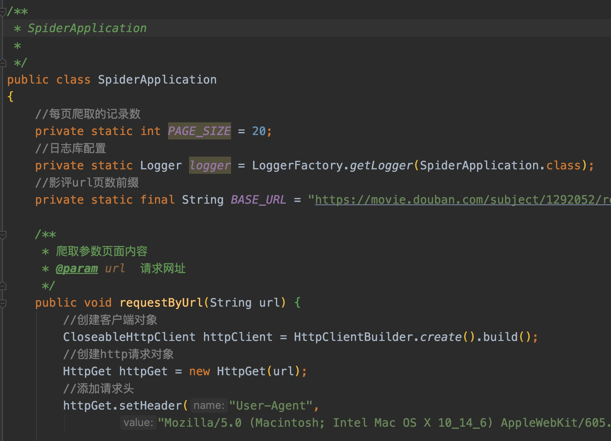
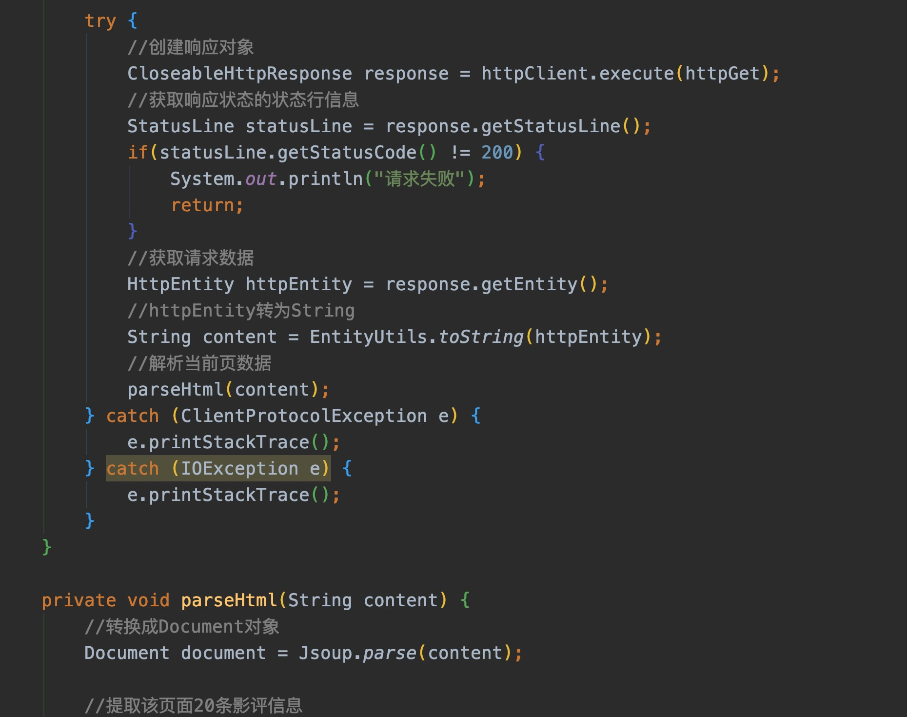
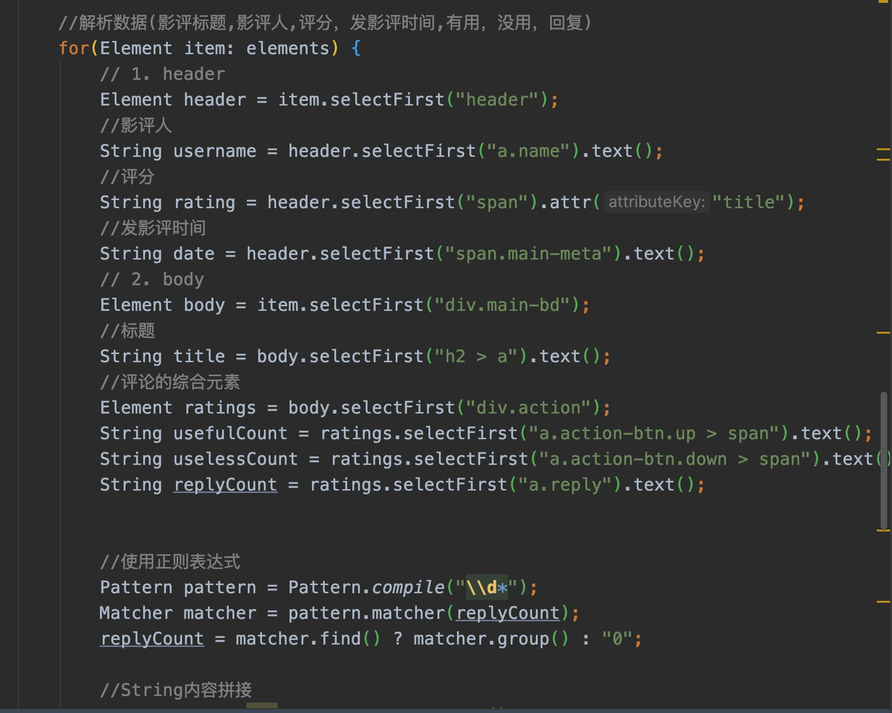
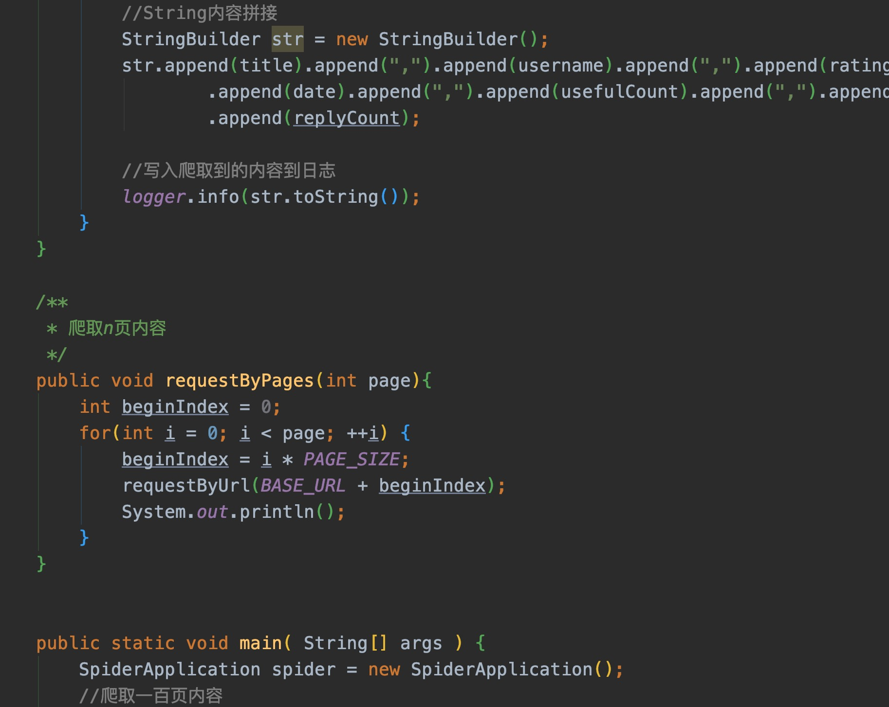
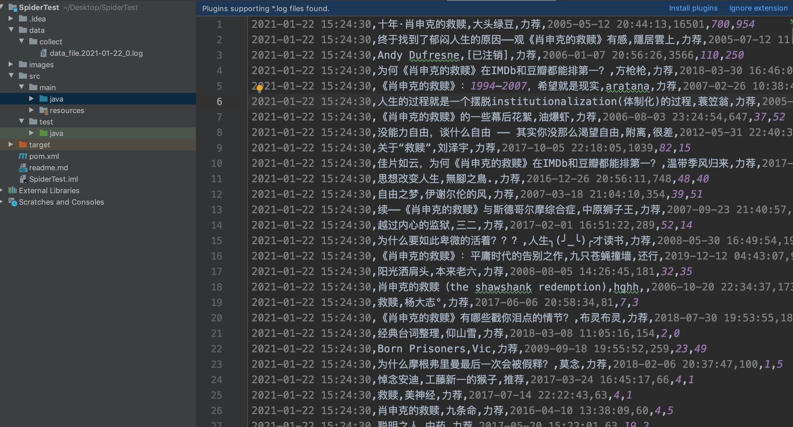
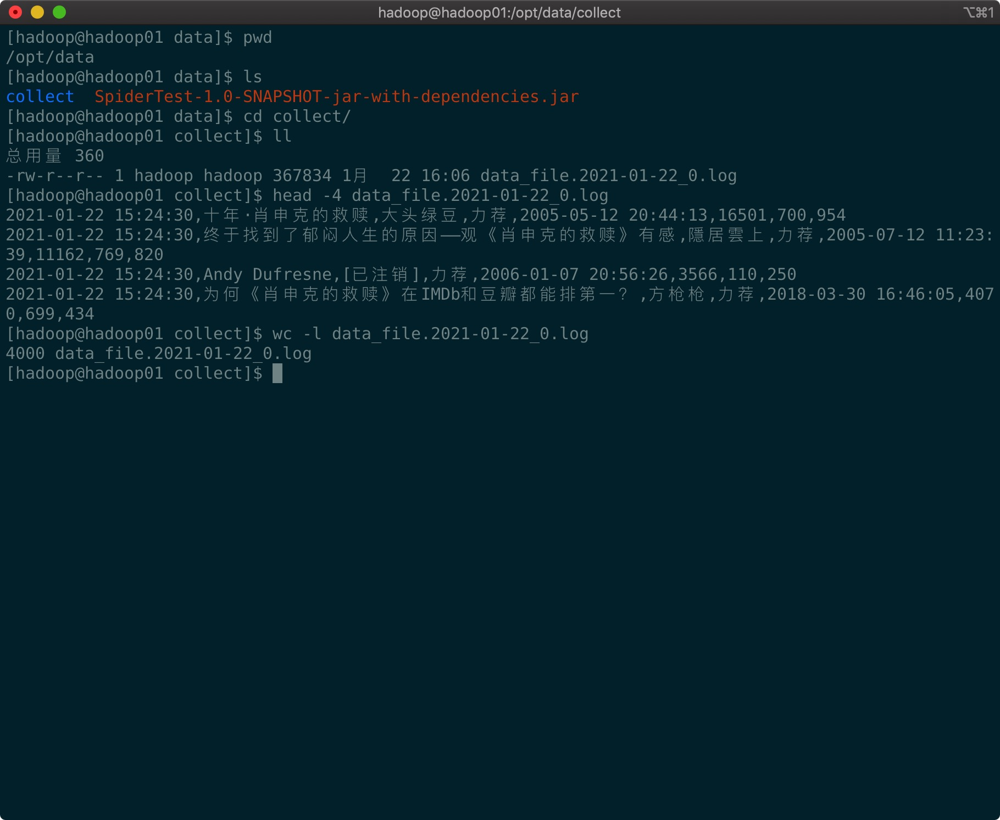

### 作业名称：爬取电影肖申克的救赎电影影评100页数据
### 提交日期：2021/1/22 18:00
### 内容描述
#### 第一步

test

发送请求和获取响应，创建HttpClient对象，并设置请求头。通过该客户端来获取响应体。

#### 第二步

判断响应状态是否成功，若状态码为200成功则获取响应体的内容。

#### 第三步

使用Jsoup库解析响应体的内容，根据爬虫项目的需要使用选择器选择相应的元素内容。该项目中包括影评标题,影评人,评分，发影评时间,有用，没用，回复。并将内容按格式拼接后写入日志。

#### 第四步

将jar包程序上传到服务器运行。

### 源码截图

### 效果截图

